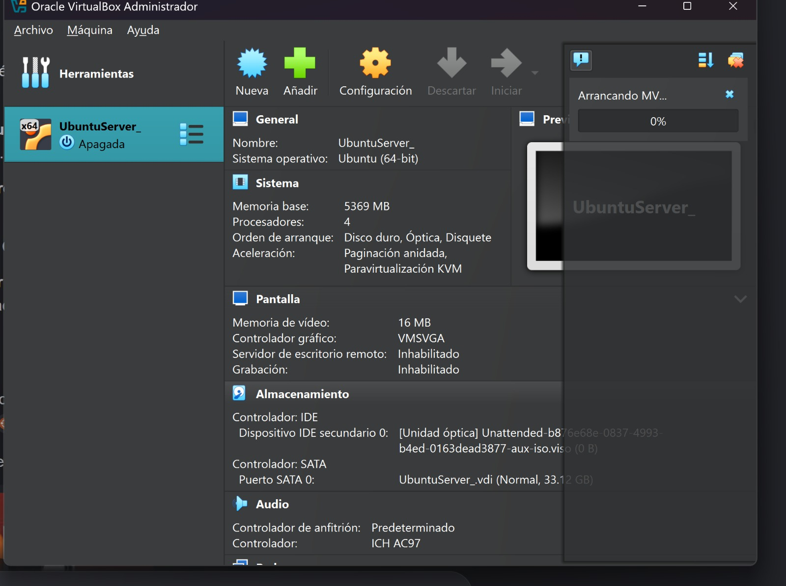
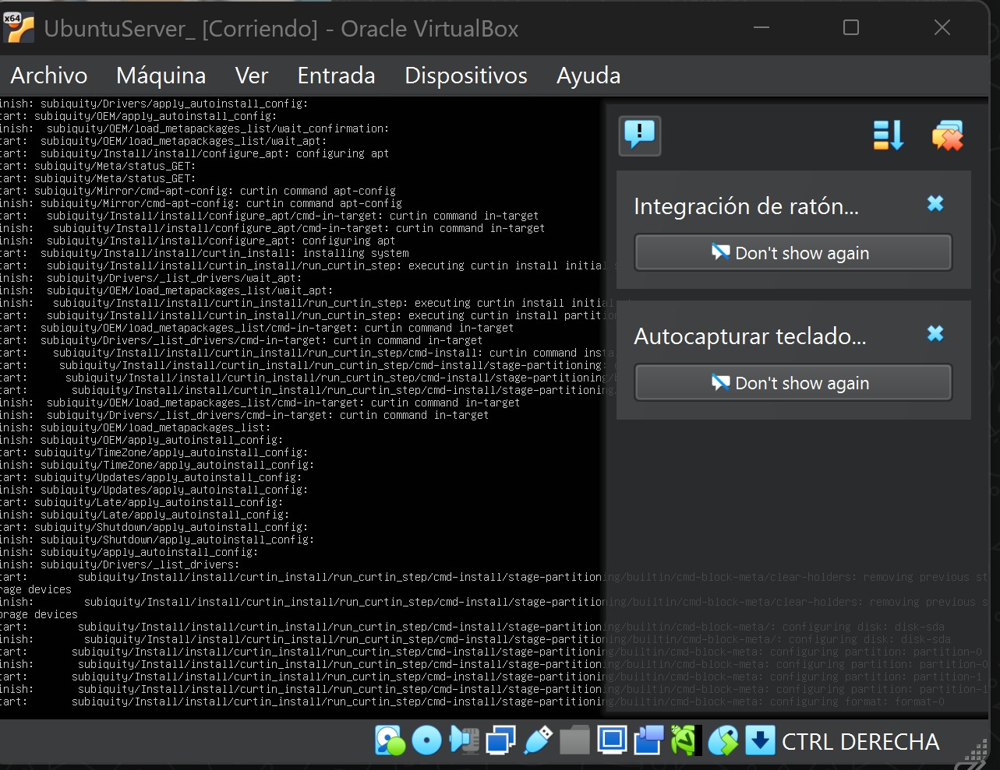
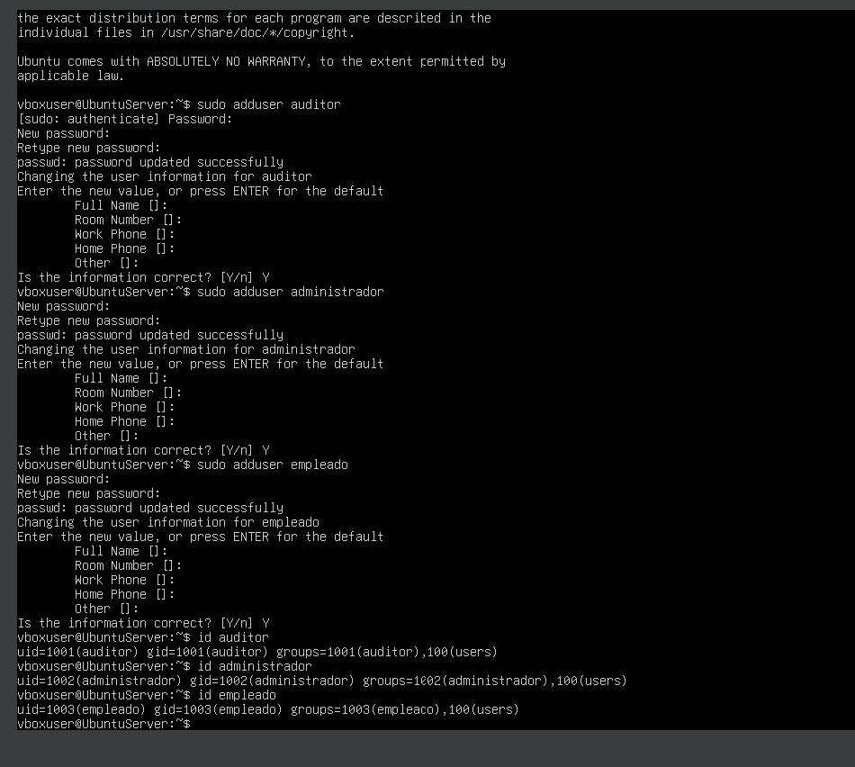

# Actividad 1: Creación de un Servidor Linux

## Objetivo
Implementar un servidor Ubuntu Server en una máquina virtual y gestionar usuarios con diferentes roles.

## Entorno
- VirtualBox
- Ubuntu Server

## Usuarios creados

- auditor
- administrador
- empleado

## Comandos utilizados

```bash
sudo adduser auditor
sudo adduser administrador
sudo adduser empleado

```
## Evidencias

### Instalación de Ubuntu Server




### Creación de usuarios

